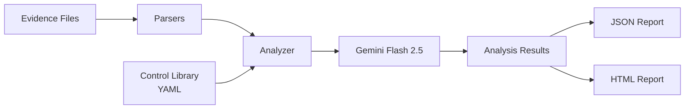

# SOC 2 Evidence Analyzer

AI-powered SOC 2 evidence analysis using Gemini — assess control effectiveness from raw evidence in seconds.


## Why This Exists

SOC 2 audits require evaluating hundreds of evidence artifacts against Trust Services Criteria. This is slow, inconsistent, and subjective. This tool uses **Gemini Flash 2.5** as an AI auditor to ingest evidence files, map them to controls, assess compliance, identify gaps, and produce structured reports — in seconds instead of hours.

## What This Demonstrates

A working prototype of the assurance pattern I build at enterprise scale: control definitions held as
structured data, evidence assessed against them automatically, and every judgment returned with a
confidence score and named gaps, so a reviewer can check the machine's work instead of trusting it.

- **Controls as data, not prose.** 14 Trust Services Criteria controls defined in YAML with explicit
  points of focus, evidence expectations and a scoring rubric, so the same control is tested the same
  way every cycle.
- **Structured, auditable output.** JSON schema enforcement and typed Pydantic models, so results are
  machine-checkable and diffable rather than free text.
- **Evidence quality scored separately from compliance.** A control can be assessed as met on weak
  evidence, and the report says so rather than hiding it.

## Quick Demo

```bash
$ soc2-analyzer analyze sample_evidence/firewall_rules.txt --control CC6.1

┏━━━━━━━━━┳━━━━━━━━━━━━━━━━┳━━━━━━━━━━━━┳━━━━━━━━━┳━━━━━━━━━━━━━━━━━━━━━━━━━━━━━━━━━━━━━━━┓
┃ Control ┃ Assessment     ┃ Confidence ┃ Quality ┃ Key Finding                           ┃
┡━━━━━━━━━╇━━━━━━━━━━━━━━━━╇━━━━━━━━━━━━╇━━━━━━━━━╇━━━━━━━━━━━━━━━━━━━━━━━━━━━━━━━━━━━━━━━┩
│ CC6.1   │ Partially Met  │        78% │ HIGH    │ SSH open to 0.0.0.0/0 on bastion host │
└─────────┴────────────────┴────────────┴─────────┴───────────────────────────────────────┘
```

## Architecture



**Supported evidence formats:** PDF, PNG/JPG (via Gemini vision), CSV, TXT, JSON, YAML

## Installation

```bash
git clone https://github.com/romilrawat2112-alt/soc2-evidence-analyzer.git
cd soc2-evidence-analyzer
pip install -e .
```

Set your Gemini API key:
```bash
export GOOGLE_API_KEY=your_key_here
```

Get an API key at [Google AI Studio](https://aistudio.google.com/apikey).

## Usage

```bash
# Analyze a single file against a specific control
soc2-analyzer analyze sample_evidence/firewall_rules.txt --control CC6.1

# Auto-detect relevant controls using AI
soc2-analyzer analyze sample_evidence/aws_iam_policy.json --auto-map

# Generate an HTML report from a directory of evidence
soc2-analyzer report sample_evidence/ --output audit_report.html

# Generate a JSON report
soc2-analyzer report sample_evidence/ --output audit_report.json --format json

# List available controls
soc2-analyzer controls list

# Show details for a specific control
soc2-analyzer controls show CC6.1
```

## Control Library

The tool includes 14 SOC 2 Trust Services Criteria controls defined in YAML:

- **CC6.1–CC6.8** — Logical and Physical Access Controls
- **CC7.1–CC7.5** — System Operations
- **CC8.1** — Change Management

### Adding Custom Controls

Create a YAML file in the `controls/` directory:

```yaml
controls:
  - id: "CUSTOM.1"
    category: "Custom Controls"
    title: "My Custom Control"
    description: "Description of the control requirement."
    points_of_focus:
      - "Focus area 1"
      - "Focus area 2"
    evidence_expectations:
      - "Expected evidence type 1"
    scoring_guidance:
      fully_met: "When to score as fully met"
      partially_met: "When to score as partially met"
      not_met: "When to score as not met"
      not_applicable: "When the control doesn't apply"
```

## How It Works

1. **Parse** evidence files into text (or image bytes for screenshots)
2. **Load** the relevant SOC 2 control definitions from YAML
3. **Construct** a structured prompt with control context, scoring rubric, and evidence content
4. **Send** to Gemini Flash 2.5 with JSON schema enforcement for guaranteed structured output
5. **Parse** the response into typed Pydantic models
6. **Generate** JSON and/or HTML reports with executive summaries and per-control detail cards

Images are sent directly to Gemini's multimodal vision API — no OCR dependencies needed.

## Sample Output

```json
{
  "control_id": "CC6.1",
  "assessment": "PARTIALLY_MET",
  "confidence": 0.78,
  "relevance_score": 0.92,
  "strengths": [
    "Network segmentation with distinct subnets for web, database, and bastion tiers",
    "WAF rules configured with common attack prevention",
    "VPN using strong encryption (AES-256-GCM)"
  ],
  "gaps": [
    "SSH (port 22) open to 0.0.0.0/0 on bastion security group",
    "Development environment has database port exposed to internet"
  ],
  "evidence_quality": "HIGH",
  "recommendations": [
    "Restrict bastion SSH access to known IP ranges only",
    "Isolate development environment from production network"
  ]
}
```

## Running Tests

```bash
pip install pytest
pytest tests/ -v
```

## License

MIT
